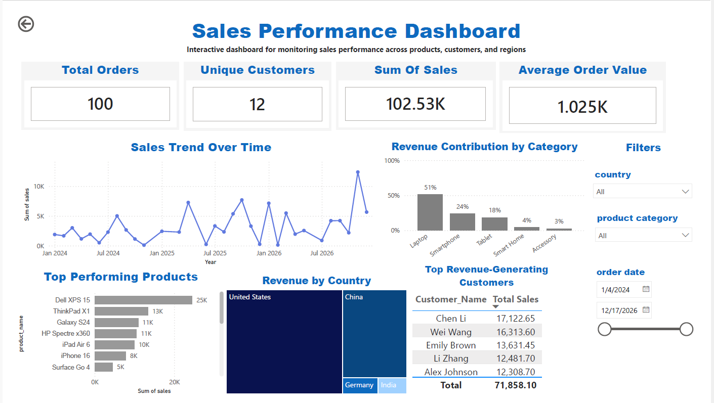

# Sales-Performance-Dashboard

## 📌 Project Overview

This project is an interactive **Sales Performance Dashboard** built in **Power BI** to analyze sales performance across products, customers, and countries.

The dashboard enables users to monitor key business metrics, identify top-performing products and customers, analyze revenue distribution, and explore sales trends through interactive visualizations.

---

## 🎯 Business Objective

The goal of this dashboard is to help business stakeholders answer questions such as:

- How is the business performing overall?
- How have sales changed over time?
- Which product categories contribute the most revenue?
- Which products generate the highest sales?
- Which countries are the strongest markets?
- Who are the top revenue-generating customers?

---
## 💡 Key Insights

- Laptop products contribute the largest share of total revenue.
- The United States is the highest revenue-generating market.
- Revenue varies over time, highlighting seasonal fluctuations.
- A small group of customers contributes a significant portion of total sales.

---
## 📊 Dashboard Features

### Executive KPIs

The dashboard provides four key performance indicators:

- Total Orders
- Unique Customers
- Total Sales
- Average Order Value (AOV)

---

### Sales Trend Analysis

Track sales performance over time to identify trends and monitor business growth.

---

### Revenue Contribution by Category

Analyze how each product category contributes to total revenue.

---

### Revenue by Country

Compare revenue across different countries to identify the strongest markets.

---

### Top Performing Products

Identify products generating the highest sales.

---

### Top Revenue-Generating Customers

Analyze the customers contributing the most revenue.

---

### Interactive Filters

The dashboard includes slicers that allow users to filter results by:

- Country
- Product Category
- Order Date

---

## 🛠 Tools & Technologies

- Power BI
- Power Query
- DAX
- Data Modeling
- Data Visualization

---

## 📚 Skills Demonstrated

- Data Cleaning
- Data Modeling
- DAX Measures
- KPI Design
- Dashboard Design
- Business Analysis
- Interactive Reporting

---


## 💡 Key Insights

- Laptop products contribute the largest share of total revenue.
- The United States is the highest revenue-generating market.
- Revenue varies over time, highlighting seasonal fluctuations.
- A small group of customers contributes a significant portion of total sales.

---

## 📂 Dataset

This repository does **not** include the original dataset.

It is shared for educational and portfolio purposes to demonstrate Power BI dashboard design, DAX calculations, and business analysis techniques.

---

## 📁 Repository Structure

```text
Sales-Performance-Dashboard/
│
├── Sales Performance Dashboard.pbix
├── README.md
└── images/
    └── Sales_dashboard.png
```
## 📈 Dashboard Preview

